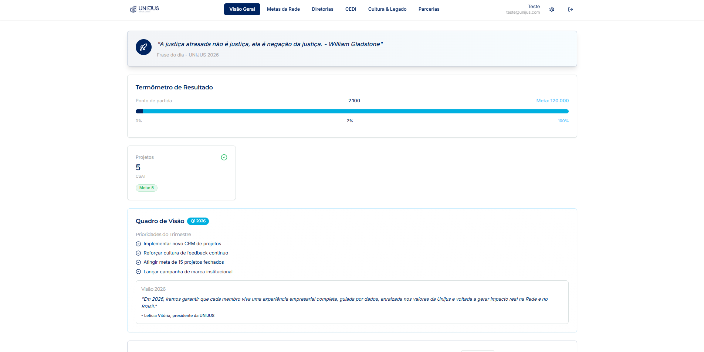
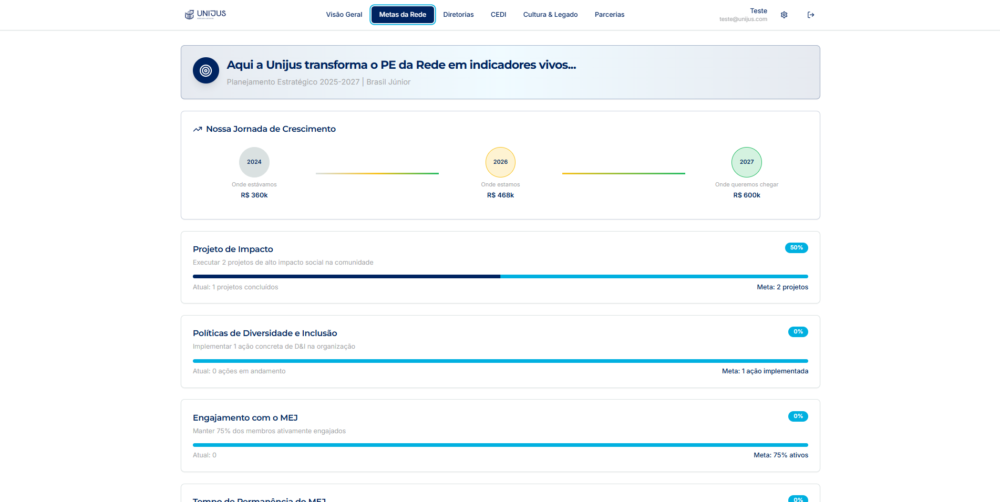
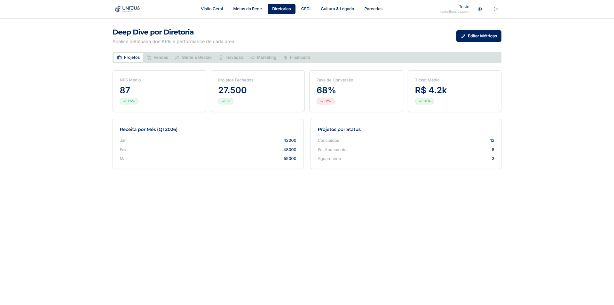

# 💼 Portfólio — Levi Costa

Vitrine dos projetos que desenvolvi para clientes e organizações. O código-fonte destes projetos é privado por envolver dados e regras de negócio de terceiros — aqui documento o problema, a solução e o resultado de cada um.

Projetos com código aberto estão nos [meus repositórios](https://github.com/levicostaq?tab=repositories).

📫 [LinkedIn](https://linkedin.com/in/levicostaq) · [Voltar ao perfil](https://github.com/levicostaq)

---

## 🏛️ Torre de Controle — Unijus

**Dashboard de gestão estratégica para empresa júnior de Direito da UNIFOR**

A diretoria da Unijus acompanhava metas, receita e indicadores de cada área em planilhas separadas, sem uma visão consolidada do andamento da empresa. A Torre de Controle centraliza esses dados em um painel único, conectando o Planejamento Estratégico da Brasil Júnior aos números reais de cada diretoria.

**Resultado:** melhor análise do andamento da empresa e de cada diretoria, com indicadores acompanhados em tempo real pela gestão.

### Principais funcionalidades

- **Visão Geral** — termômetro de resultado com progresso em relação à meta anual e cards de acompanhamento rápido
- **Metas da Rede** — jornada de crescimento plurianual e progresso dos projetos de impacto do PE 2025-2027
- **Deep Dive por Diretoria** — KPIs segmentados por área (Projetos, Vendas, Gente & Gestão, Inovação, Marketing, Financeiro) com NPS, ticket médio, taxa de conversão e receita mensal
- **Edição de métricas** pela própria diretoria, sem depender de desenvolvedor
- Controle de acesso por autenticação

### Stack

`React` · `TypeScript` · `Tailwind CSS` · `Supabase` · `Recharts`

### Telas

> Os dados exibidos nas imagens são fictícios, usados para demonstração.

**Visão Geral — termômetro de resultado**

**Metas da Rede — jornada de crescimento e projetos de impacto**

**Deep Dive por Diretoria — KPIs detalhados por área**

---

## 🤖 Bot de agendamento — Consultório oftalmológico

**Automação de agendamento e confirmação de consultas via WhatsApp**

O consultório dependia das secretárias para responder manualmente cada pedido de agendamento, confirmação e remarcação pelo WhatsApp — um volume alto de mensagens repetitivas consumindo o expediente. O bot assume esse primeiro atendimento, entende a intenção do paciente, consulta a disponibilidade e registra o agendamento, escalando para atendimento humano quando o caso foge do padrão.

**Resultado:** reduziu o trabalho manual, otimizando o tempo das secretárias do consultório.

### Principais funcionalidades

- Atendimento automatizado no WhatsApp com interpretação de linguagem natural
- Agendamento, confirmação e remarcação de consultas
- Persistência dos agendamentos em banco de dados
- Transbordo para atendimento humano quando necessário

### Stack

`n8n` · `Evolution API` · `Supabase` · `IA generativa`

### Demonstração

> 🚧 Prints e diagrama do fluxo em breve.

---

## ⚖️ Sistema para escritório de advocacia

> 🚧 Em documentação.

---

Interessado em detalhes técnicos de algum destes projetos? É só chamar.
